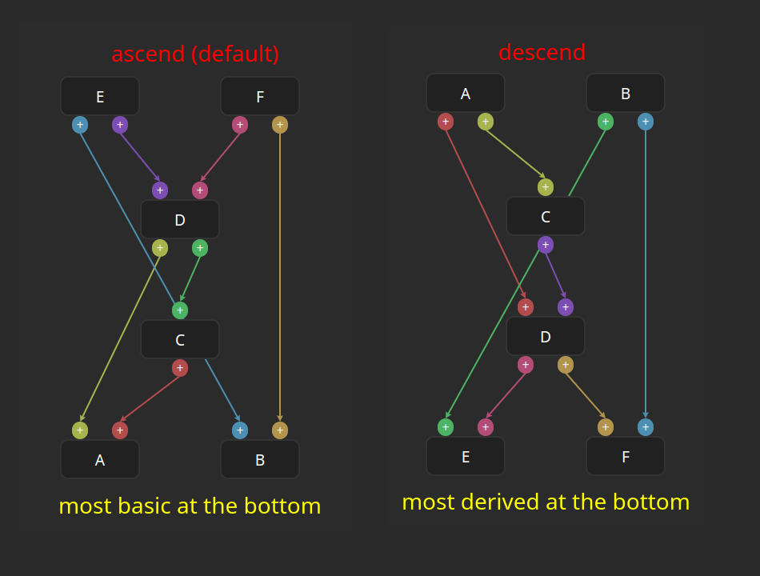

## algo-config

These fields control the behavior of the graph generation algorithm related to
the placements of nodes.

It is difficult to explain these without an example graph. Consider the following
set of nodes. The images below are based on these nodes.

```yaml
  - name: A
  - name: B
  - name: C
    depends-on:
      - A
  - name: D
    depends-on:
      - A
      - C
  - name: E
    depends-on:
      - B
      - D
  - name: F
    depends-on:
      - D
      - B
```

### node-sorting

By default, the graph generation places the most fundamental nodes at the bottom
(Node A and B in the graph above).
The default behavior resembles the construction of a building.
Complex ideas are built on the TOP of fundamental ideas.

However, the common flow of ideas in a book or a webpage is from top to bottom.
For that, we can use `node-sorting: descend`. Here the most fundamental nodes will be
placed at the top. Compare these two graphs:



Node positions get flipped along the vertical axis.
Also, notice that the arrows still keep a top to bottom flow.

Note: This behavior of arrows may change in the future.

### arrow-direction

This controls the direction of the arrows. There are two options:
* child2parent (default)
* parent2child

### level-strategy

This controls how the levels are assigned to each node.  There are two options:
* bottom2top (default)
* top2bottom

With `bottom2top`, all the nodes without dependencies get the bottom row.
Other nodes are progressively arranged on the top. The level of a node is 1
more than the max level of all its dependencies. This is usually enough for
most of the use-cases.

However in some cases, we want to assign levels from the other end.
All the nodes that are not used by any other node as a dependency is assigned
the top row. In other words, all the nodes at the top will have 0 users.
Every other node gets a level 1 below the minimum level of all its users.
This is the strategy used for `top2bottom`.


It is highly encouraged to try the various strategies on a small graph before
trying anything big.
